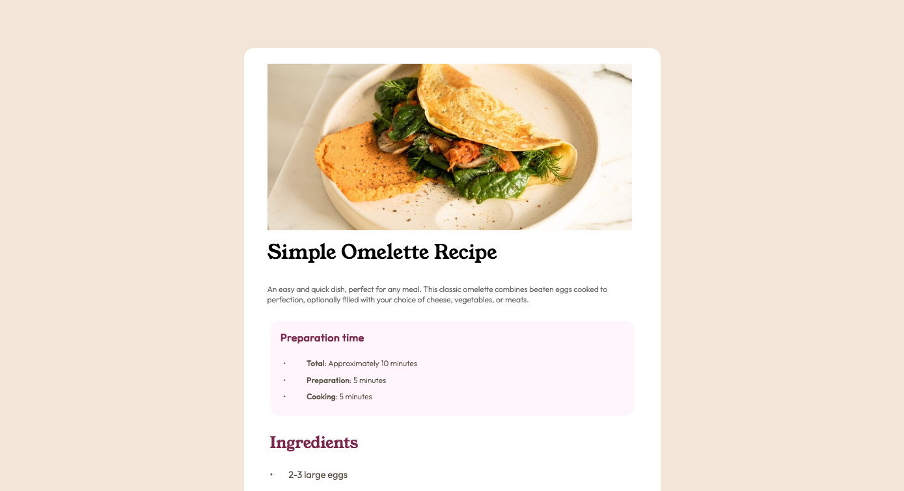

# Frontend Mentor - Recipe page solution

This is a solution to the [Recipe page challenge on Frontend Mentor](https://www.frontendmentor.io/challenges/recipe-page-KiTsR8QQKm). Frontend Mentor challenges help you improve your coding skills by building realistic projects. 

## Table of contents

- [Overview](#overview)
  - [The challenge](#the-challenge)
  - [Screenshot](#screenshot)
  - [Links](#links)
- [My process](#my-process)
  - [Built with](#built-with)
  - [What I learned](#what-i-learned)
  - [Continued development](#continued-development)
  - [Useful resources](#useful-resources)
- [Author](#author)
- [Acknowledgments](#acknowledgments)


## Overview

### Screenshot



### Links

- Solution URL: [Add solution URL here](https://your-solution-url.com)
- Live Site URL: [Live site](https://mohamedballa.github.io/Recipe-page-main/)

## My process

### Built with

- Semantic HTML5 markup
- CSS custom properties

### What I learned
In this challenge i was able to build normalize css to have consistency throught the layout.  
Also use of css variables. over all it was reapplying what i learned(layout organization , the process of solving the problem by dividing it to small step)

```css
*,
*::before,
*::after {
	box-sizing: border-box;
	margin: 0;
	padding: 0;
}
:root{
	/*variables*/
	--border-radius: 15px;
	--box-shadow: 15px 10px;
	--box-shadow-2: 0 10px 15px -3px rgba(0, 0, 0, 0.1),
    0 4px 6px -2px rgba(0, 0, 0, 0.05); 
    /* other varialbes */
}
```


### Continued development

In the future I want to try more complex layout using felx box and Grid .

### Useful resources

mostly googling. high recomend kevin powell in youtube his channel is invaluable. 

## Author

- Frontend Mentor - [@mohamedballa](https://www.frontendmentor.io/profile/mohamedballa)
- X - [@mhballa1](https://x.com/mhballa1)


